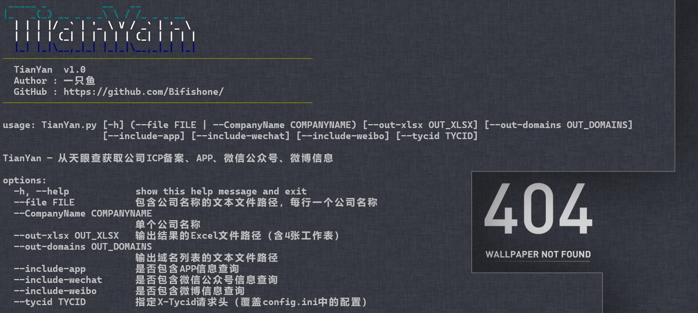
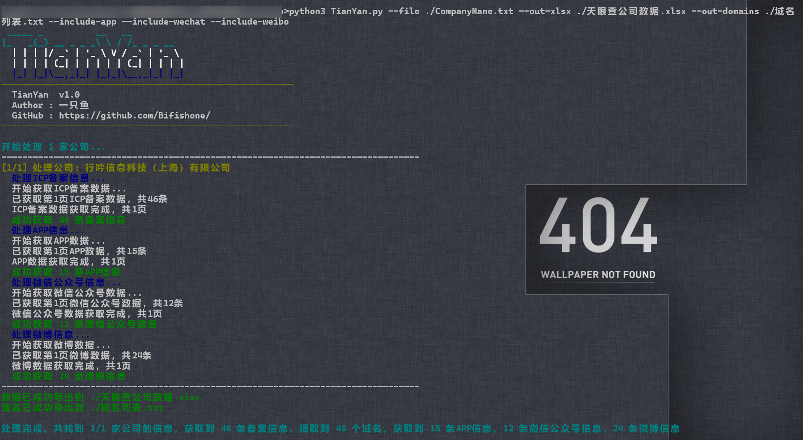
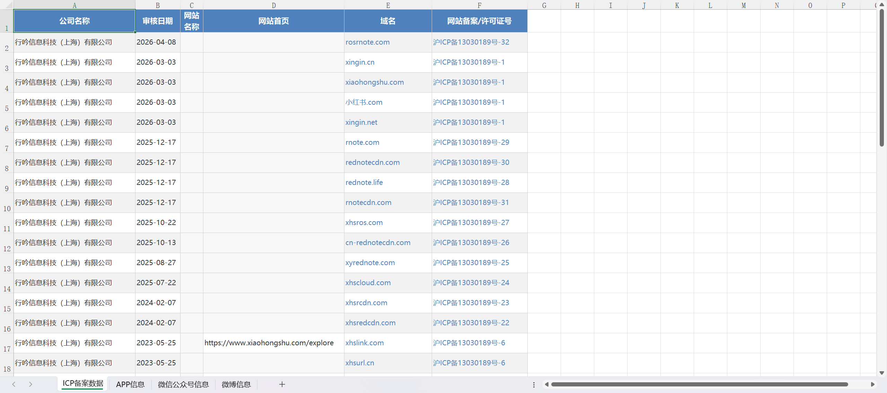
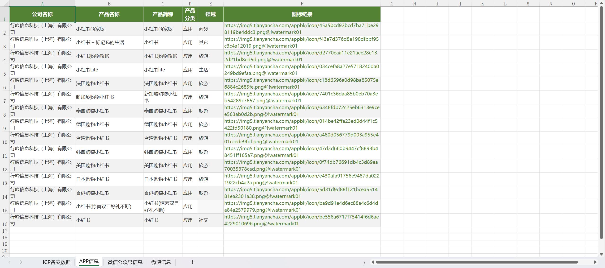
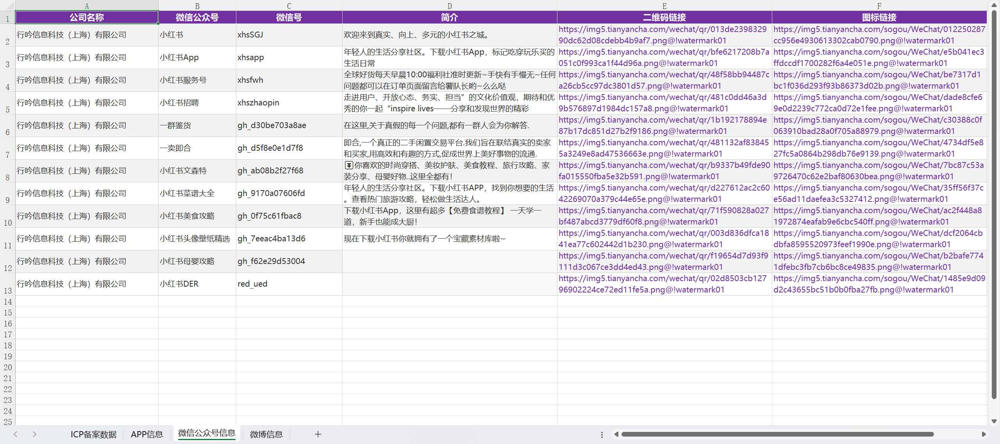
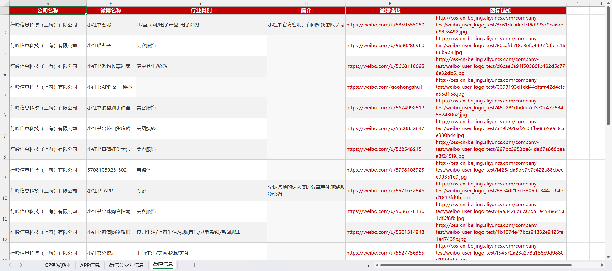

<h1 align:"center"> TianYan · 天眼 </h1>

**一键自动化企业信息采集工具**

[](https://www.python.org/)[](LICENSE)[]()

---

## 📖 简介

**TianYan（天眼）** 是一款基于天眼查平台的自动化企业信息采集工具。输入公司名称后，自动搜索公司信息，并发起多维度数据查询，一键导出结构化的 Excel 报表和域名列表。

> 🎯 适用于安全研究、渗透测试前期信息收集、企业资产梳理等合规场景。



---

## ✨ 功能特性

| 模块 | 数据内容 | 说明 |
|------|----------|------|
| **ICP 备案** | 网站名称、域名、备案号、审核日期、网站首页 | 核心模块，始终启用 |
| **APP 信息** | 产品名称、产品简称、分类、领域、图标链接 | 通过 `--include-app` 启用 |
| **微信公众号** | 公众号名称、微信号、简介、二维码、图标 | 通过 `--include-wechat` 启用 |
| **微博信息** | 微博名称、行业类别、简介、微博链接、图标 | 通过 `--include-weibo` 启用 |
| **域名提取** | 从 ICP 备案中提取全部域名 | 输出至独立文本文件 |

- 📊 **专业 Excel 报表** — 多 Sheet 分表、斑马纹、自适应列宽、差异化配色
- 📁 **批量处理** — 支持文件导入公司列表，自动逐个查询
- 🔄 **自动翻页** — 智能分页逻辑，数据全量获取不遗漏
- 🛡️ **双重搜索** — API 优先 + HTML 页面解析回退，最大程度保证查询成功率

---

## 🚀 快速开始

### 安装依赖

```bash
pip install requests pandas openpyxl beautifulsoup4 colorama pyfiglet
```

### 配置认证

编辑 `config.ini`，在 `[tianyancha]` 部分填入你的天眼查账号凭证：

```ini
[tianyancha]
cookies = CUID=xxx; TYCID=xxx; auth_token=xxx; ...
x-auth-token = eyJhbGc..........your_token_here...
tycid = e62101e0........e9cd14139416c04
```

> 🔑 **如何获取？** 登录 [天眼查](https://www.tianyancha.com) 后，打开浏览器开发者工具（F12）→ Network 标签 → 找到任意 `capi.tianyancha.com` 请求 → 复制 `Cookie` 和 `X-Auth-Token` 请求头。

---

## 📋 使用方法

### 查看帮助

```bash
python3 TianYan.py -h
```

### 查询单个公司

```bash
python3 TianYan.py \
  --CompanyName "行吟信息科技（上海）有限公司" \
  --out-xlsx ./小红书.xlsx \
  --out-domains ./域名列表.txt
```

### 批量查询（从文件）

```bash
python3 TianYan.py \
  --file ./CompanyName.txt \
  --out-xlsx ./公司数据.xlsx \
  --out-domains ./域名列表.txt \
  --include-app \
  --include-wechat \
  --include-weibo
```

`CompanyName.txt` 格式（每行一个公司名称）：

```
行吟信息科技（上海）有限公司
深圳市腾讯计算机系统有限公司
华为技术有限公司
```

### 一键启动（Windows）

双击 `TianYan.bat` 即可运行预设的批量查询任务。



---

## ⚙️ 命令行参数

| 参数 | 说明 | 必填 |
|------|------|:----:|
| `--CompanyName` | 单个公司名称 | 二选一 |
| `--file` | 包含公司名称的文本文件路径 | 二选一 |
| `--out-xlsx` | 输出 Excel 文件路径 | 否 |
| `--out-domains` | 输出域名列表文件路径 | 否 |
| `--include-app` | 启用 APP 信息查询 | 否 |
| `--include-wechat` | 启用微信公众号信息查询 | 否 |
| `--include-weibo` | 启用微博信息查询 | 否 |
| `--tycid` | 指定 X-Tycid（覆盖 config.ini） | 否 |

> ⚠️ `--out-xlsx` 和 `--out-domains` 至少需要指定一个。

---

## 📊 输出示例

### Excel 报表

生成的 `.xlsx` 文件包含多张工作表：

| Sheet 名称 | 字段 |
|------------|------|
| **ICP备案数据** | 公司名称、审核日期、网站名称、网站首页、域名、网站备案/许可证号 |
| **APP信息** | 公司名称、产品名称、产品简称、产品分类、领域、图标链接 |
| **微信公众号信息** | 公司名称、微信公众号、微信号、简介、二维码链接、图标链接 |
| **微博信息** | 公司名称、微博名称、行业类别、简介、微博链接、图标链接 |

每张工作表独立配色：
- 🔵 ICP 备案 — 蓝色主题

  

- 🟢 APP 信息 — 绿色主题

  

- 🟣 微信公众号 — 紫色主题

  

- 🔴 微博信息 — 红色主题

  

### 域名列表

```
rosrnote.com
xingin.cn
xiaohongshu.com
...
```

---

## 🗂️ 项目结构

```
TianYan/
├── TianYan.py              # 主程序
├── TianYan.bat             # Windows 一键启动脚本
├── config.ini              # 配置文件（认证信息）
├── CompanyName.txt         # 待查询公司列表
├── 天眼查公司数据.xlsx       # 输出 Excel（示例）
├── 域名列表.txt             # 输出域名列表（示例）
```

---

## 🔧 config 配置

`config.ini` 配置项：

| 配置节 | 说明 |
|:-------|------|
| `[tianyancha]` | 天眼查认证信息（本工具核心配置） |

---

## 📝 更新日志

### v1.0

- ✨ 首次发布
- ✅ ICP 备案信息采集
- ✅ APP 信息采集
- ✅ 微信公众号信息采集
- ✅ 微博信息采集
- ✅ 双重搜索策略（API + HTML 回退）
- ✅ 专业 Excel 报表（多 Sheet / 差异化配色）
- ✅ 域名自动提取与导出

---

## 🤝 贡献

欢迎提交 Issue 和 Pull Request！

如有问题或建议，请通过 GitHub 联系作者。

---

## 📄 免责声明

> ⚠️ 本工具仅供**合法合规**的信息收集和网络安全研究使用。
>
> - 请遵守《网络安全法》《数据安全法》《个人信息保护法》等相关法律法规
> - 仅可用于授权测试、企业自身资产管理、学术研究等合法场景
> - 使用者需自行承担因滥用本工具而产生的一切法律后果

---

<div align="center">

**Made with ❤️ by 一只鱼**

[](https://github.com/Bifishone/)
